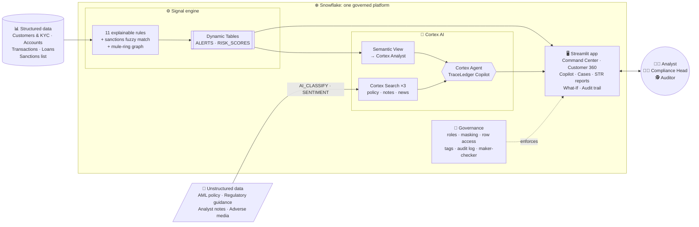
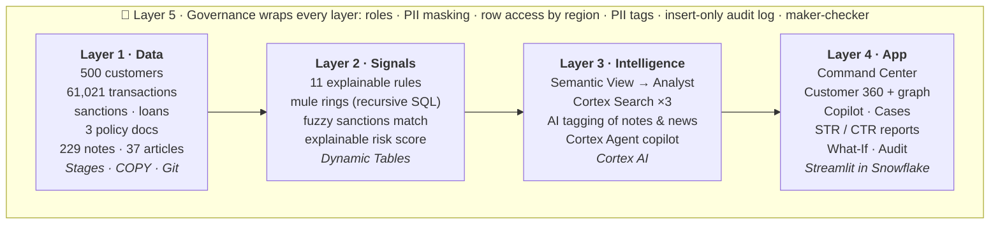
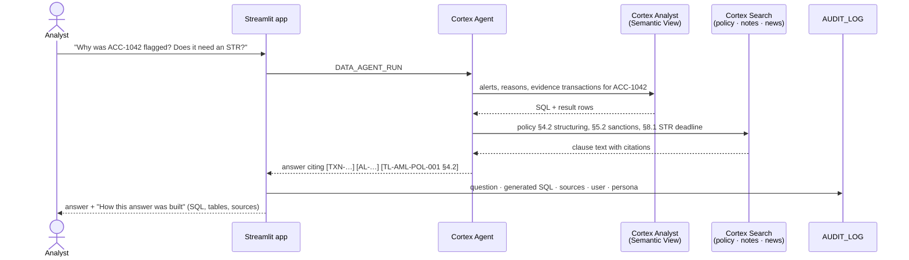

<div align="center">

# 🔎 TraceLedger

### The AML & Fraud Investigation Copilot, built entirely on Snowflake

*From suspicious signal → cited evidence → audit-ready Suspicious Transaction Report, in minutes instead of days.*

**Challenge track:** Risk, Fraud and Regulatory Intelligence Copilot


</div>

---

## ⚡ TraceLedger in 30 seconds

> A compliance analyst asks: **"Why was account ACC-1042 flagged, and does it need an STR?"**
>
> TraceLedger answers in one screen:
> - **What happened:** 9 cash deposits of ₹9.2–9.8 lakh, each just under the ₹10 lakh reporting threshold, followed by ₹85 lakh wired to a UAE company on the sanctions watchlist.
> - **The evidence:** the exact transaction IDs.
> - **The rule broken:** *"AML Policy §4.2 Structuring"*, quoted from the bank's own policy document.
> - **The risk score:** `Score 100 = Sanctions 50 + Structuring 35 + Income mismatch 20 + Adverse media 10`. No black box.
> - **The next step:** a one-click **Suspicious Transaction Report draft** that cites every fact. A compliance head approves it (maker-checker), and every step lands in an immutable audit trail.

Everything runs **inside Snowflake**: data, rules, AI, app and governance. No data leaves the platform.

---

## 🎯 The problem

Banks and NBFCs are legally required to detect money laundering and report it to the Financial Intelligence Unit (FIU-IND) **within 7 working days**. Today, that process is broken:

| Pain point | Reality in compliance teams |
|---|---|
| **Alert fatigue** | Rule engines raise thousands of alerts, and over 90% are false positives. Analysts drown. |
| **Black-box scores** | ML risk scores can't be explained to a regulator, so they can't be defended. |
| **Scattered evidence** | Transactions, KYC, sanctions lists, news, call notes and policy PDFs all live in different systems. One investigation means 6+ tools. |
| **Manual reporting** | Writing a single STR takes **2–4 hours** of copy-pasting transaction IDs and policy clauses. |
| **Audit risk** | Regulators ask *"why did you close this alert?"* Without a trail of who saw what and why, the bank is exposed to penalties. |
| **Data privacy** | Analysts often see full PII (names, PAN, phone) they don't need. |

## 💡 Our solution

TraceLedger is an **explainable, governed investigation copilot** that covers the whole AML lifecycle, from **signal → evidence → decision → report → audit**, on one Snowflake platform.

| What makes it different | How |
|---|---|
| 🧾 **Every alert is explainable** | 11 SQL rules, each mapped to a numbered policy clause. Every alert carries its evidence transaction IDs and a plain-English reason. |
| 🕸️ **Finds what single-account rules miss** | Recursive SQL detects **mule rings** (A→B→C→D→A) and **fan-in hubs**. Fuzzy matching (Jaro-Winkler + edit distance) catches **sanctions near-matches**. |
| ⏱️ **Real time** | **Dynamic Tables** recompute alerts and scores within ~1 minute of a new transaction. |
| 🤖 **A copilot that cites, never guesses** | A **Cortex Agent** combines **Cortex Analyst** (SQL over a semantic view) with **Cortex Search** (policies, analyst notes, news). Every claim must cite an ID; otherwise it answers *"Insufficient evidence"*. |
| 📝 **STR in one click, with a guardrail** | Cortex AI drafts the STR or closure memo from the case evidence. A **citation guardrail** blocks saving if the AI cites any ID that isn't in the evidence. |
| 🔐 **Governed by design** | Roles, **dynamic masking** of PII, **row access by region**, PII tags, maker-checker approvals and an **insert-only audit log**. |
| 🎛️ **Policy tuning, not guesswork** | A **What-If simulator** shows how many alerts a new threshold would create before the Compliance Head applies it. |

---

## 🏗️ Architecture

### End-to-end view



### Layer by layer



### How a question is answered (Cortex Agent)



---

## ❄️ Snowflake technology used

| Capability | Snowflake feature | Where |
|---|---|---|
| Ingestion | Internal stages, file formats, `COPY INTO`, **Git integration** | `00`–`02`, `bootstrap.sql` |
| Detection rules | SQL views, window functions, **recursive CTEs** (mule rings) | `04_signals_rules.sql` |
| Fuzzy sanctions screening | `JAROWINKLER_SIMILARITY`, `EDITDISTANCE` | `05_signals_screening.sql` |
| Real-time alerts and scores | **Dynamic Tables** (1-minute target lag) | `06_signals_alerts.sql` |
| Unstructured → AI | `AI_CLASSIFY`, `SENTIMENT`, `AI_COMPLETE` (`AI_PARSE_DOCUMENT` on paid accounts) | `09_docs_ai_search.sql` |
| RAG over policies, notes and news | **Cortex Search** (3 services) | `09_docs_ai_search.sql` |
| Natural language → SQL | **Semantic View** + **Cortex Analyst** | `10_semantic_view.sql` |
| Orchestration | **Cortex Agent** (+ Snowflake Intelligence chat) | `11_agent.sql` |
| Application | **Streamlit in Snowflake** | `app/streamlit_app.py` |
| Governance | Roles, **masking policies**, **row access policies**, **object tags**, grants | `13_governance.sql` |
| Cost control | XS warehouse, 60s auto-suspend, resource monitor | `00_setup.sql` |

---

## 🧭 What the analyst sees (7 pages)

| Page | Highlights |
|---|---|
| **Command Center** | Live KPIs (alerts, high-risk customers, open cases, STRs pending/filed, value flagged), alerts by rule and typology, a 12-month trend, flagged customers with *"why this score"* |
| **Customer 360** | Profile and explainable score, every alert with its evidence transactions and policy clause, transaction timeline, **money-flow network graph**, sanctions and counterparty screening, AI-categorised news, AI-tagged analyst notes, accounts and loans |
| **Investigation Copilot** | Chat with the Cortex Agent. Each answer shows **the generated SQL, result tables, retrieved documents and cited IDs** |
| **Case Management** | Alerts become a case: Open → Under review → Escalated → STR filed / Closed. Assignment, notes, full history |
| **Report Generator** | AI-drafted **STR** and **closure memo** with the citation guardrail, **maker-checker approval**, CTR report (CSV), regulatory summary (AML + credit + liquidity) |
| **What-If Simulator** | Re-tune the structuring rule and see the alert impact before applying it. Liquidity stress (LCR) if the top depositors withdraw |
| **Audit Trail** | Every question, SQL statement, source, report version, approval and status change, exportable |

**Personas** (sidebar "Acting as"): **Analyst** (maker, masked PII, own region) · **Compliance Head** (checker, full PII, approves) · **Auditor** (read-only, masked).

---

## 🎬 Demo story (3 minutes)

1. **Live signal.** Three ₹9–10 lakh cash deposits and a wire to a watchlisted UAE company are inserted for a *clean* customer (`08_live_alert_demo.sql`). Within a minute the Dynamic Tables raise alerts and the score jumps **0 → 100**.
2. **Command Center.** The new high-risk customer appears, with *"Score 100 = SCR-SAN 50 + TM-STR 35 + TM-RIO 20"*.
3. **Customer 360.** Evidence transactions, the sanctions near-match, adverse news, and the money-flow graph showing where the cash went.
4. **Copilot.** *"Why was ACC-1042 flagged and does it need an STR?"* The answer cites transactions and policy clauses, and shows the generated SQL.
5. **Case → STR.** Open a case, generate the STR (the guardrail verifies every cited ID), and save the draft as the **Analyst**.
6. **Maker-checker.** Switch to **Compliance Head** and approve. The case becomes **STR_FILED**.
7. **Governance.** Switch to **Auditor**: names are masked (`R*** B***`), buttons are locked, and the **Audit Trail** shows everything that happened.

---

## 📊 Results

The dataset contains **planted typologies** with an answer key (`CORE.GROUND_TRUTH`), so detection quality is measurable (`07_validate_signals.sql`):

| Typology | Rule | Planted | Detected |
|---|---|---|---|
| Structuring | TM-STR (§4.2) | 6 | **6** |
| Velocity spike (mule) | TM-VEL (§4.3) | 5 | **5** |
| Dormant reactivation | TM-DOR (§4.4) | 5 | **5** |
| High-risk geography / round-tripping | TM-GEO (§4.5) | 4 | **4** |
| Income mismatch | TM-INC (§4.6) | 5 | **5** |
| Round amounts | TM-RND (§4.7) | 4 | **4** |
| Pass-through | TM-RIO (§4.8) | 4 | **4** |
| Mule rings + fan-in hub | TM-NET (§4.9) | 10 | **10** |
| Sanctions near-match | SCR-SAN (§5.2) | 6 | **6** |
| PEP third-party credits | SCR-PEP (§3.4) | 3 | **3** |
| **Total** | | **52 customers** | **100% recall** |

- **No clean customer reaches MEDIUM or HIGH risk.** 448 clean customers stay LOW.
- The only alerts on clean customers are 2 **same-name adverse-media hits**: realistic false positives that demonstrate the *close-as-false-positive* workflow.
- Tuning mattered. A naive Jaro-Winkler match flagged *"Shree Logistics"* as a sanctions hit on *"Redsea Logistics"*. Blending it with edit distance removed every false sanctions match while keeping all true ones.

---

## 🔐 Governance and responsible AI

| Control | Implementation |
|---|---|
| **Least privilege** | `TL_ANALYST`, `TL_COMPLIANCE_HEAD`, `TL_AUDITOR` roles with scoped grants |
| **PII masking** | Name `R*** B***`, PAN `XXXXXX234E`, phone `+91-XXXXXX3210`, birth year only. Full data for the Compliance Head |
| **Row access** | Analysts see only customers in their region (WEST: 151 of 500) |
| **Classification** | `PII_TYPE` tags on every personal-data column |
| **Immutable audit** | `AUDIT_LOG` is insert-only for every role. Records the question, generated SQL, sources, user and persona |
| **Maker-checker** | The persona that drafts an STR can't approve it (AML Policy §7.4) |
| **Grounded AI** | The agent must cite IDs or say *"Insufficient evidence"*. Reports citing unknown IDs can't be saved |
| **No tipping-off** | Reports carry the PMLA tipping-off warning, and recommendations are limited to the 4 options in Policy §8.5 |

---

## 🚀 Run it yourself

**One click:** in a Snowflake account where Cortex AI is available (for example AWS US West, Oregon; Enterprise edition), open a SQL file in Snowsight, paste [`sql/bootstrap.sql`](sql/bootstrap.sql) and click **Run All**. In about 10 minutes it will:
1. Connect Snowflake to this GitHub repo (Git integration).
2. Load the data and policy documents.
3. Build the rules, Dynamic Tables, Cortex Search services, the Semantic View and the Cortex Agent.
4. Create the Streamlit app and apply the governance policies.

<details>
<summary><b>Step-by-step instead</b></summary>

| Step | File | What it does |
|---|---|---|
| 1 | `00_setup.sql` → `03_validate.sql` | Warehouse, schemas, stages, tables, load, row counts (upload `data/*.csv` and `docs/policies/*` to the stages first) |
| 2 | `04_signals_rules.sql` → `07_validate_signals.sql` | Rules, screening, Dynamic Tables, detection results |
| 3 | `08_live_alert_demo.sql` | Live alert demo (run step by step) |
| 4 | `09_docs_ai_search.sql` → `11_agent.sql` | Cortex AI enrichment, Search, Semantic View, Agent |
| 5 | `12_app_setup.sql` + `app/streamlit_app.py` | App tables, then create a Streamlit app and paste the code |
| 6 | `13_governance.sql` | Roles, masking, row access, tags, grants |

</details>

---

## 📁 Repository

```
app/streamlit_app.py          Streamlit in Snowflake app (7 pages, persona-aware)
sql/bootstrap.sql             one-click setup from GitHub
sql/00-03                     Layer 1 · setup, tables, load, validation
sql/04-08                     Layer 2 · rules, screening, Dynamic Tables, results, live demo
sql/09-11                     Layer 3 · Cortex AI enrichment, Search, Semantic View, Agent
sql/12                        Layer 4 · cases, findings, audit log
sql/13                        Layer 5 · roles, masking, row access, tags
data/                         synthetic dataset (CSV) incl. answer key
data_gen/                     deterministic data + policy-PDF generators
docs/policies/                AML policy, regulatory guidance, Basel/liquidity note (MD + PDF)
```

---

## 📌 About the data

All data is **synthetic** and generated deterministically by `data_gen/generate_data.py`. It's an Indian banking context (INR, RBI/PMLA/FATF-style policy) with realistic baseline behaviour and planted laundering patterns. The policy documents are written for this project and aren't legal advice. No real person or institution is represented.

<div align="center">

**TraceLedger: every alert explained, every claim cited, every decision audited.**

Built by **AkhilT9**

</div>
